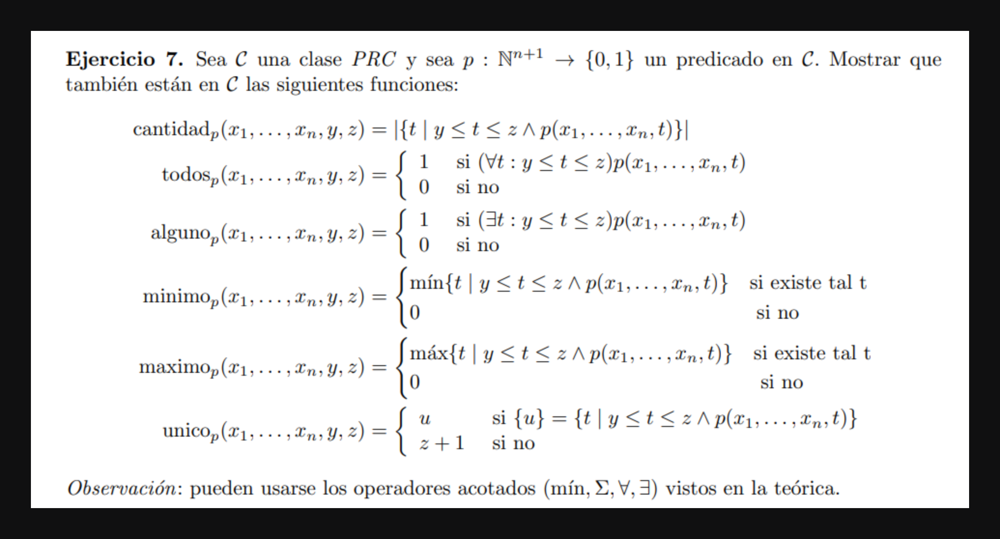
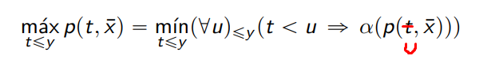

## a
>$$cantidad_p(x₁, ⋯ xₙ, y, z) = ∑_{t=y}^{z} p(x₁... xₙ, t) $$

## b

> $$todosₚ(x₁,⋯,xₙ, y, z) = (∀ \ t)_{≤z} (t < y \  ∨ p(x₁,⋯,xₙ,, t)) $$

## c

> $$algunoₚ(x₁,⋯,xₙ, y, z) = (∃ \ t)_{≤z} (t ≥ y \ ∧ p(x₁,⋯,xₙ,, t))$$

## d

> $$minimoₚ(x₁,⋯,xₙ, y, z) = \min_{t≤z} ( t ≥ y \ ∧ \ p(x₁,⋯,xₙ, t) )$$

## e
Dado en clase práctica 2

> $$maximo(x₁,⋯,xₙ, y, z) = \max_{t≤z} (t ≥ y \ ∧ \ p(x₁,⋯,xₙ, t)) $$

## f

> $$unico(x₁,⋯,xₙ, y, z) = \\ (cantidadₚ(x₁,⋯,xₙ, y, z) = 1) · (minimoₚ(x₁,⋯,xₙ, y, z))  + \\ (cantidadₚ(x₁,⋯,xₙ, y, z) ≠ 1) · (z + 1)$$
