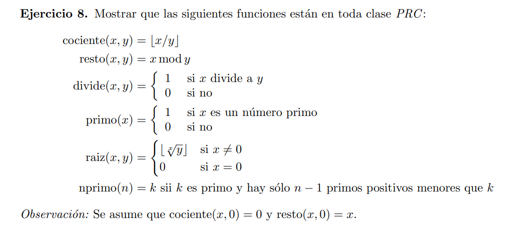
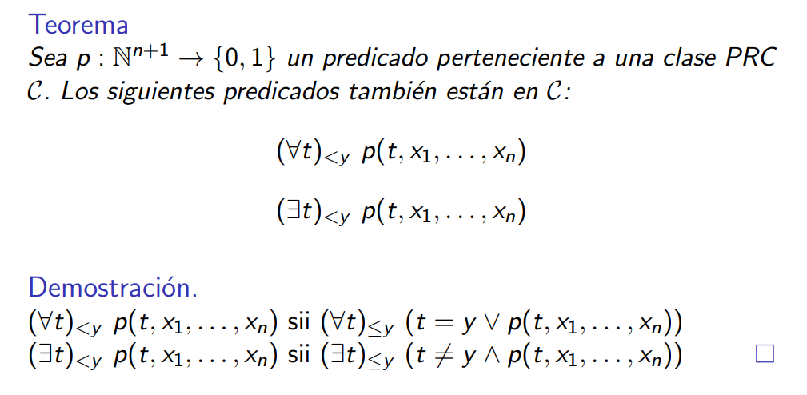
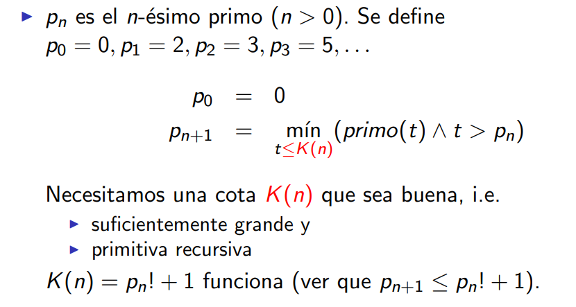

## a

> $$ cociente(x, y) = \min_{t ≤ x} ((t+1) · y > x) $$

## b

> $$ resto(x,y) = x \ ∸ \ cociente(x,y) · y $$

## c

> $$ divide(x, y) = (resto(x, y) = 0) $$

## d

> $$ primo(x) = α( (∃t)_{≤x} (t ≠ 1 ∧ t ≠ x ∧ divide(x, t))) $$

Solución dada por la cátedra
> $$ primo(x) = α( (∃t)_{<x} (t > 1 ∧ divide(x, t))) $$

## e

> $$ raiz(x, y) = (x ≠ 0) · (\max_{t ≤ y} (tˣ ≤ y)) $$

## f

Solución dada por la cátedra

Otra cota seria $p = p_1 p_2 ⋯ p_n, \ K(n) = p + 1 $. Sabemos que tiene que haber un primo entre $p_n$ y p+1. (demo en teorica 3) 

> $$ nprimo(n) = p_{n} $$

uso $p_{n}$ ya que $p_{1} = 2$ tiene 0 primos menores a él, $p_{2} = 3$ tiene 1 primo menor que el, ... $p_{n}$ tendrá n-1 primos menores a él.
