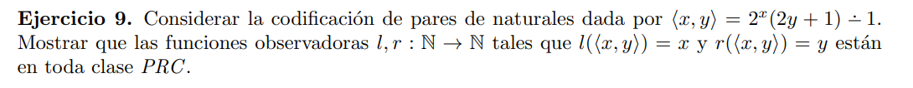
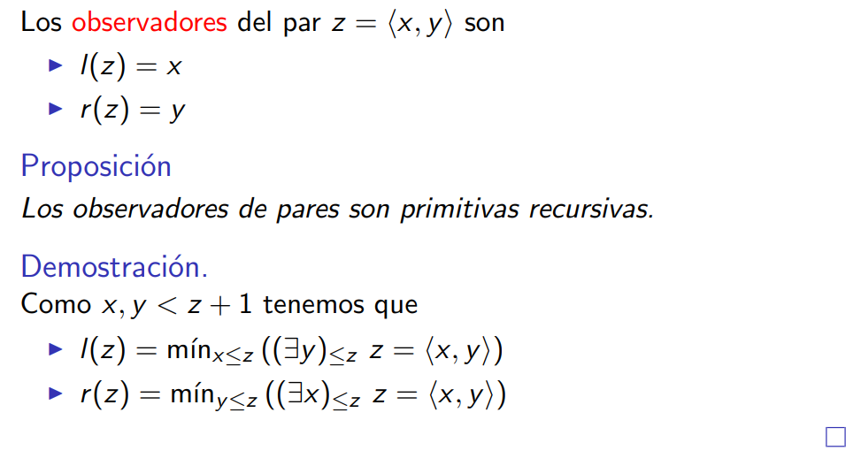

Como para cada $z$ existe un único par, entonces el mínimo va a dar dichos valores de $x$ e $y$

Sabemos que si el predicado de la función mínimo está en una clase PRC $C$, entonces la función $min$ también lo está. En este caso la función $<x, y>$ definida por potencia, producto, suma y resta natural es primitiva recursiva y por lo tanto está en toda clase PRC. Luego la función $=$ también es primitiva recursiva, por lo que el predicado $z= <x,y>$ está e toda PRC. Del mismo modo si el predicado de la función cuantificador está en una clase $C$, la función pertenece a dicha clase. En este caso el predicado es primitivo recursivo, sigue que la definición de $l(z)$ y $r(z)$ estan en toda clase PRC