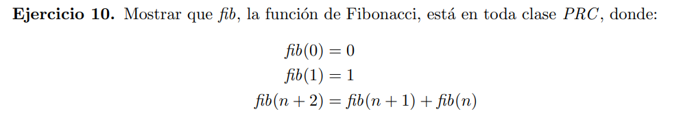

Defino una función auxiliar $h: \N \rightarrow \N $ de la siguiente manera:

$h(n) = [fib(n), fib(n+1)]$

Vamos a ver que esta función es p.r.
> #### caso base
> $$ h(0) = [fib(0), fib(1)] = [0, 1] $$

que es un natural por lo tanto pertenece a la clase p.r. (y por lo tanto a toda clase PRC)

> #### paso recursivo
> $$ \begin{align*}
    h(n+1) & = [fib(n+1), fib(n+2)] \\ 
           & = [fib(n+1), fib(n+1) + fib(n)] \\
           & = [h(n)[2], h(n)[2] + h(n)[1] ] 
    \end{align*} $$

Luego h es primitiva recursiva ya que $h(n+1)$ se puede expresar solo usando $h(n)$ y operaciones que son composición o p.r.

Y al ser primitiva recursiva pertence a toda clase PRC

Luego observamos que $f(n) = h(n)[1] $