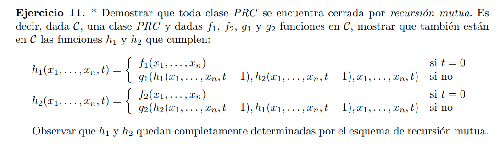

Defino una función auxiliar $h: \N \rightarrow \N $ de la siguiente manera:

$h(x_1, \cdots x_n, n) = [h_1(x_1, \cdots x_n, n), h_2(x_1, \cdots x_n, n)]$

> #### Caso base
> $$ h(x_1, \cdots x_n, 0) = [f_1(x_1, \cdots x_n), f_2(x_1, \cdots x_n)] $$

> #### Paso recursivo
> $$ \begin{align*}
        h(x_1, \cdots x_n, n+1) = & \ [g_1(h_1(x_1, \cdots x_n, n), h_2(x_1, \cdots x_n, n),x_1, \cdots x_n, n ) , \\ 
        & g_2(h_2(x_1, \cdots x_n, n), h_1(x_1, \cdots x_n, n),x_1, \cdots x_n, n )] \\ \\
        = & \ [g_1(h(n)[1], h(n)[2], x_1, \cdots x_n, n), \\
        & g_2(h(n)[2], h(n)[1], x_1, \cdots x_n, n)]
    \end{align*}$$

Luego $h$ sigue el esquema de recursión primitiva y es composicion de funciones p.r. y de $f_1, f_2, g_1, g_2 \in C$ por lo tanto $h \in C$ 

> #### Codificación de la función original
> $$ h_1(x_1, \cdots x_n, n) = (t=0) \cdot h(x_1, \cdots x_n, 0)[1] + h(x_1, \cdots x_n, n)[1] \\
h_2(x_1, \cdots x_n, n) = (t=0) \cdot h(x_1, \cdots x_n, 0)[2] + h(x_1, \cdots x_n, n)[2] $$

Entonces $h_1, h_2 \in C$