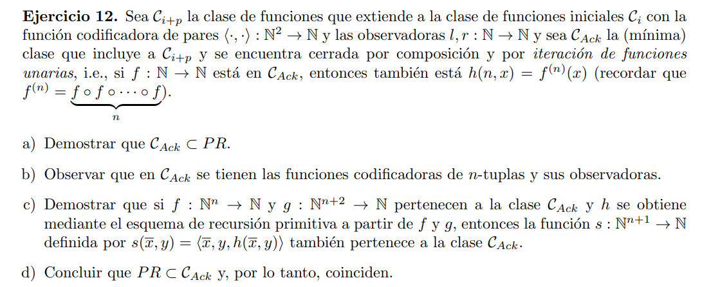
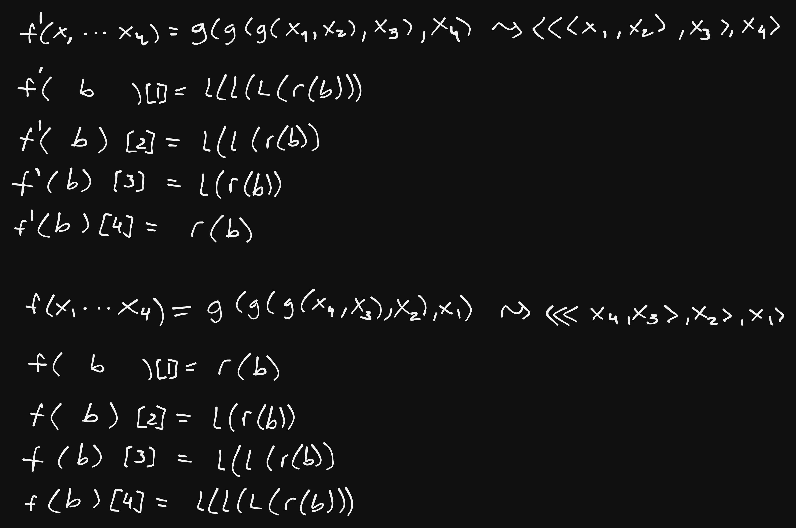
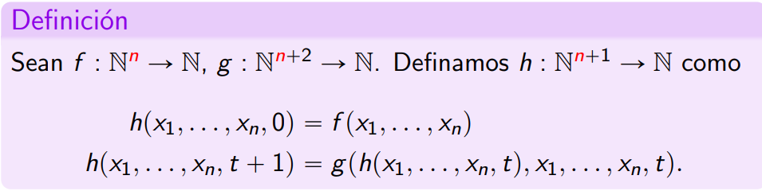

## a

Queremos ver que $C_{Ack} \subset PR$ la clase de funciones primitivas recursivas. Para esto tenemos que ver que toda función de $C_{Ack}$ es p.r.

$C_{Ack}$ está compuesta por las iniciales, que ya sabemos que son primitivas recursivas, y la función codificadora de pares con sus observadores que también sabemos que son p.r.

Faltaría ver entonces que cualquier función formada por iteración de funciones unarias sobre las funcioens de $C_{Ack}$ son tambien p.r.

Supongamos que tengo una función $h: \N^2 \rightarrow \N$ armada por iteración de una función $f: \N \rightarrow \N \in C_{Ack}$ tal que $h(n, x) = f^{(n)}(x)$

> #### caso base
> $f$ es alguna inicial, o una codificación de pares, con sus observadores, o una compocisión de ellas (esto lo podemos afirmar porque $C_{Ack}$ es mínima), por lo que pertenece a p.r.
> $ h(0,x) = f(x) $ 

> #### paso inductivo
> ##### hipotesis inductiva:
> $ h(n, x) = f^{(n)}(x) \in p.r. $
> ##### qvq
> $ h(n+1, x) = f^{(n+1)}(x) $ pero $ f^{(n+1)}(x) = f(f^{(n)}(x))$
> que es una compocisión de funciones en p.r. ya que $f^{(n)}$ está en p.r. por hipotesis inductiva, y $f$ habiamos dicho que también esta en p.r. (caso base)

Luego $C_{Ack} \subset PR$

## b

Hay varias formas de codificar n-uplas en este esquema. Por ej, de izq a der o de der a izq.

En general para n-uplas tenemos la composición

> $f: \N^n \rightarrow \N$
> $f(x_1 \cdots x_n) = \langle \cdots \langle \langle  x_n , x_{n-1}\rangle , x_{n-2} \rangle , \cdots , x_1  \rangle = \langle x_1 \cdots x_n \rangle  $

Y los observadores formados por iteración

> si tenemos la n-upla $a =\langle x_1 \cdots x_n \rangle$
> $a[i] = \underbrace{l(\cdots(l(}_{i-1}  r(a)))) = h(i-1, r(a))$
> $h(n, a) = l^n(a) $

La codificación y los observadores estan formados por iteraciones de funciones en $C_{Ack}$ por lo que pertenecen a la misma clase al ser cerrada por composición e iteración unaria.

## c

Para ver que la función $s \in C_{Ack}$ tenemos que ver si está formada por una función inicial, o codificación de pares, o composición o iteración de funciones unarias (ya que la clase es cerrada por ambas operaciones). 

Como $s(\bar{x}, y) = \langle \bar{x}, y, h(\bar{x}, y) \rangle$ y sabemos por el punto b que las n-uplas $\in C_{Ack}$ basta con ver que $h(\bar{x}, y) \in C_{Ack}$

$h(\bar{x}, y)$ está formada por el esquema recursión primitiva con $f, g \in C_{Ack}$

Si podemos escribir a $h$ como una composición o iteración de funciones de $C_{Ack}$ habremos probado lo requerido

## d