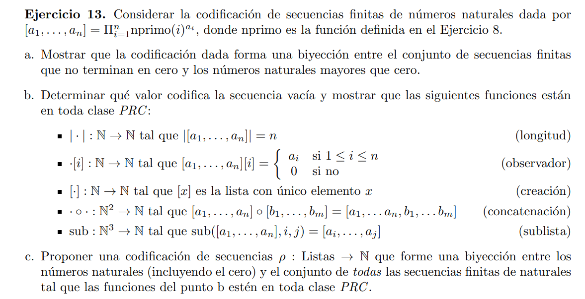
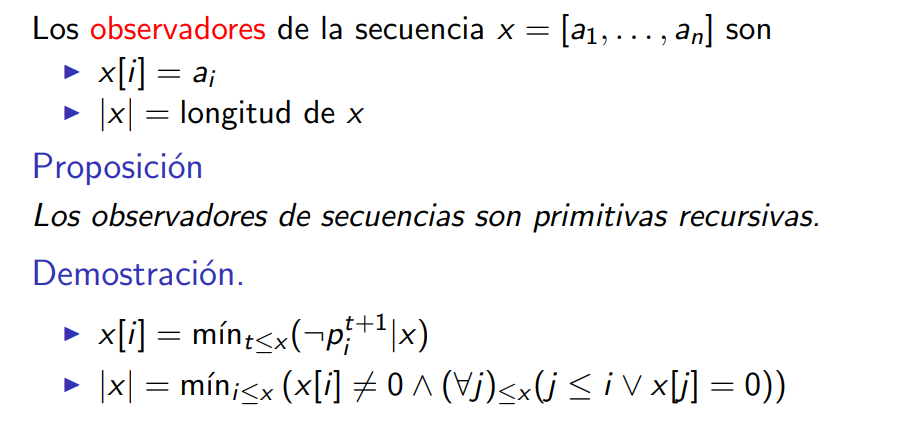

### a

El [teorema fundamental de la aritmetica](https://es.wikipedia.org/wiki/Teorema_fundamental_de_la_aritm%C3%A9tica) establece que cualquier entero positivo mayor que uno tiene una descomposición en primo. Luego si la cadena es finita y no termina en cero/s, entonces tenemos una biyección entre secuencias y numeros naturales mayores a 0.

Para el 1 podemos usar la secuencia vacia ya que la productoria vacia dá 1.

Con esto tenemos una biyección entre naturales mayores a 0 y secuencias finitas.

### b

Como se mencionó antes, la secuencia vacia codifica el 1

> $ |x| = \max_{i \leq x}{divide(nprimo(i), x)} $

> $ x[i] = \max_{j \leq x} {divide(nprimo(i)^j, x)} $

> [x] = nprimo(1)^x = 2^x

Tengo que contatenar dos listas. $|x|$ me da el n-esimo primo más grande que divide a $x$. Luego agrego los primos más grandes que este para concatenar las listas
> $ x \circ y = x \cdot \prod_{i = |x|}^{|x| + |y|}{nprimo(|x| + i)^{y[i]}}$ 

> $ sub(x, i, j) = \prod_{k = i}^{j} {nprimo(k-i)^{x[k]}} = \prod_{k = 1}^{j-i} {nprimo(k)^{x[k+i]}} $

(Bonus) dado por la cátedra

### c

