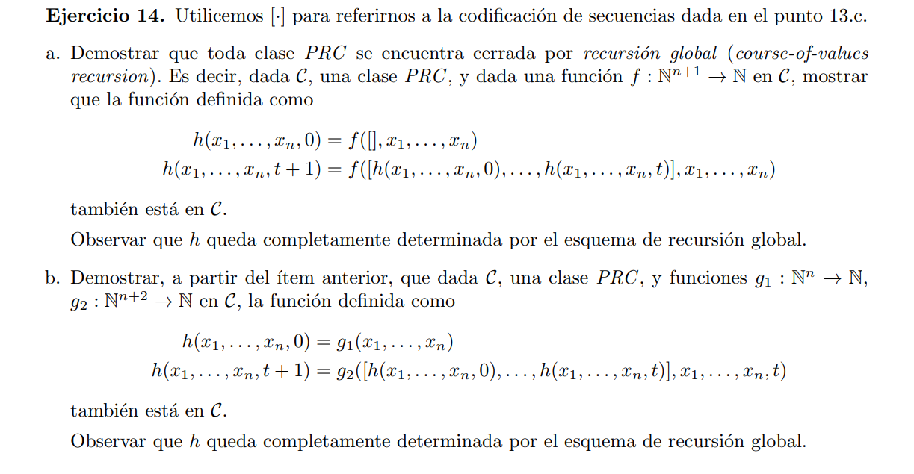

### a

defino una función $H$ auxiliar que guarde la secuencia de los $h(\bar{x},t)$: $H(\bar{x}, t)= [h(\bar{x},0), \cdots, h(\bar{x},t)]$

Veamos que esta función pertenece a $C$

#### caso base
> $H(\bar{x}, 0) = [f([], \bar{x})]$

#### paso inductivo
> $H(\bar{x},t+1) = [h(\bar{x},0), \cdots, h(\bar{x},t+1)] $ 
> $H(\bar{x},t+1) = [H(\bar{x},t)[1], H(\bar{x},t)[2], \cdots, f([h(\bar{x},0) \cdots h(\bar{x},t)],\bar{x} )]$
>$H(\bar{x},t+1) = [H(\bar{x},t)[1], \cdots, f(H(\bar{x}, t),\bar{x} )] $

Luego $H(\bar{x}, t+1)$ puede expresarse en función de $H(\bar{x}, t)$ y t, por lo que sigue el esquema de recursión primitiva. Luego como $f\in C$ entonces $H \in C$

Por ultimo notemos que $h(\bar{x}, t) = H(\bar{x}, t)[t]$ por lo que la función original pertenece a $C$

### b