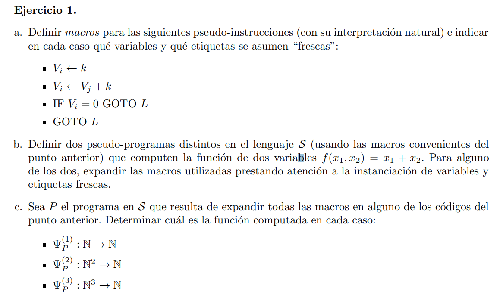
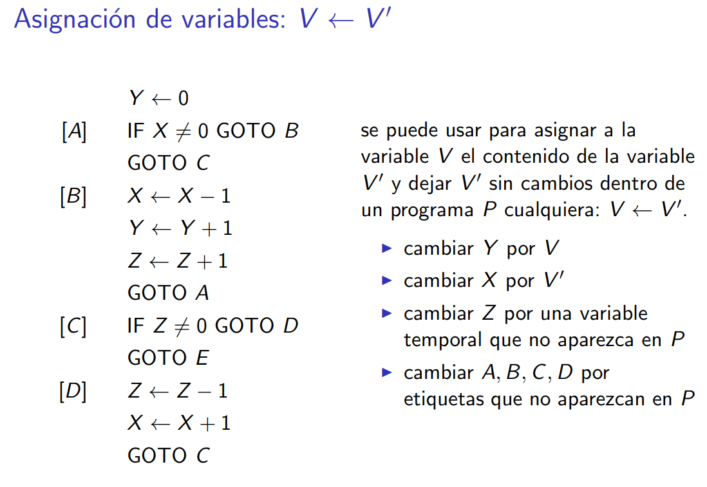

Las siguientes macros fueron dados por la cátedra




# a

Asumo $X_1 = k$

> $ V_i \longleftarrow k$


```C
[L] vᵢ = vᵢ - 1
    IF vᵢ ≠ 0 GOTO [L]

    Vᵢ ⟵ Vᵢ + 1
    ⋯ // k veces    
    Vᵢ ⟵ Vᵢ + 1
```
___

> $ V_i \longleftarrow V_j + k$

```C
    Vᵢ ⟵ Vⱼ
    Z ⟵ k // variable fresca
    IF Z ≠ 0 GOTO [L]
    GOTO E

[L] Vᵢ ⟵ Vᵢ + 1
    Z ⟵ Z - 1
    IF Z ≠ 0 GOTO [L]
```

___

> $IF \ V_i = 0 \ GOTO \ L$

```C
    IF Vᵢ ≠ 0 GOTO E
    GOTO L
[E]   
```
___

> $GOTO \ L$

```C
V ⟵ V + 1  // varible fresca
IF V ≠ 0 GOTO L
```

# b

> $f(x_1, x_2) = x_1 + x_2 $ 

```c
    Y ⟵ X₁
    Z₁ ⟵ X₂

    IF Z₁ ≠ 0 GOTO L
    GOTO E

[L] Y ⟵ Y + 1
    Z₁ ⟵ Z₁ - 1
    IF Z₁ ≠ 0 GOTO L
```

# c

$\Psi_P^{(n)}(x_1 ⋯ x_n)$ es una función que devuelve la salida del programa $P$ cuando se tiene $n$ entradas

Es la función parcial (porque se puede indefinir) que computa el programa $P$ con $n$ variables


$\Psi_P^{(1)}(x_1) = x_1 + 0 \rightarrow f(x_1, 0)$
$\Psi_P^{(2)}(x_1, x_2) = x_1 + x_2 \rightarrow f(x_1, x_2)$
$\Psi_P^{(3)}(x_1, x_2, x_3) = x_1 + x_2 + 0 \rightarrow f(x_1, x_2)$