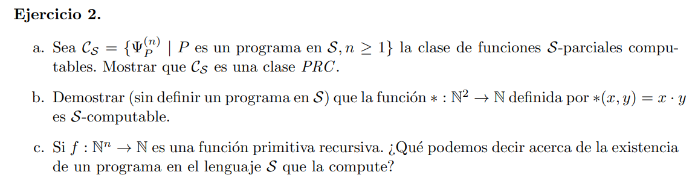

# a

Para demostrar que $C_S ∈ PRC$ hay que ver que las funciones iniciales son S-parcial computable y que está cerrada por composición y recursión primitiva

> función nula: $n(x) = 0$ con programa vacio

> función sucesor: $s(x) = x + 1 $

```c
Y ⟵ X₁ + 1
```

> función proyección $u_i^n(x_1 ⋯ x_n) = x_i $

```c
Y ⟵ Xᵢ
```

> Cerrado por composición
> Sea $f, g_1, ⋯ g_n$ funciones parcial computables entonces $h = f(g_1, \cdots g_n)$ es parcial computable

```c
Z₁ ⟵ g₁(X₁ ⋯ Xₙ)
⋯
Zₙ ⟵ gₙ(X₁ ⋯ Xₙ)
Y ⟵ f(Z₁ ⋯ Zₙ)
```

> Cerrado por recursión primitiva
> Sea $f, g_1, ⋯ g_n$ funciones parcial computables entonces $h$ obtenida por el equema de recursión primitiva por $f, g_1, ⋯ g_n$ tambien es parcial computable

```c
// Xₙ₊₁ = t

    Y ⟵ f(X₁ ⋯ Xₙ)
    Z₁ ⟵ Xₙ₊₁
    IF Z₁ ≠ 0 GOTO L
    GOTO E

[L] Z₁ ⟵ Z₁ - 1
    Y ⟵ G(Y, X₁ ⋯ Xₙ, Z₂)    
    Z₂ ⟵ Z₂ + 1
    IF Z₁ ≠ 0 GOTO L

```

Luego $C_S$ es una clase PRC. Por lo que toda primitiva recursiva es computable (ya que la clase p.r. pertenece a toda clase PRC)

# b

Sabemos por practica 1 que $*(x,y) = x ·y$ es primitiva recursiva, por lo que es computable por ej a.

# c

Las clases PRC son definidas con funciones totales. Como toda función p.r. pertenece a toda clase PRC, luego las funcioens p.r. son totales. Ahora sabemos que la clase de funciones parcial computables son una clase PRC. Por lo que toda función p.r. es parcial computable. Más aun, al ser funciones totales son computables (total computables)
