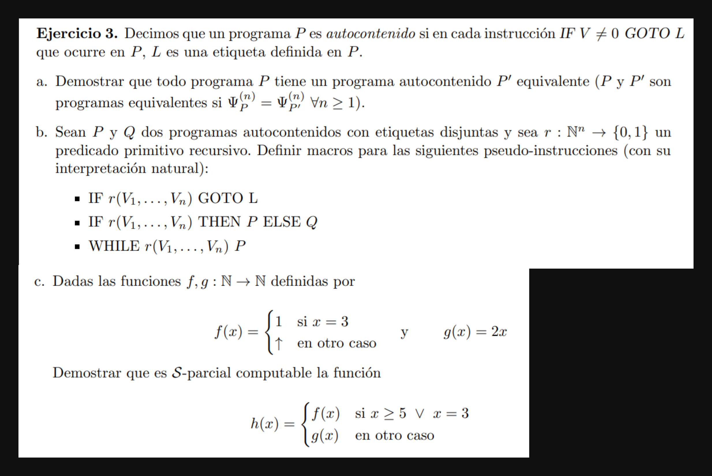

# a

Se puede hacer un programa P' que recibe un programa P y le busca las instrucciones de salto condicional que tenga etiquetas que no sean de instrucciones validas. Cuando se encuentra, define una instrucción con dicha etiqueta talque la operación sea no hacer nada ($V \longleftarrow V$). Luego agrego las nuevas instrucciones debajo del programa original $e$ y obtengo un programa $e'$ que computa la misma función que la original pero con todas las etiquetas definidas. Finalmente la salida de P' es  $Y \longleftarrow \phi^{n}(x_1, \cdots x_n, e')$

Sabemos que $\phi^{n}(x_1, \cdots x_n, e') = \phi^{n}(x_1, \cdots x_n, e)$ por como definimos el programa, el comportamiento en ambos es el mismo.

Finalemente $\phi^{n}(x_1, \cdots x_n, e') = \phi^{n}(x_1, \cdots x_n, e) \iff \psi^{n}(x_1, \cdots x_n, P') = \psi^{n}(x_1, \cdots x_n, P)$ 

# b

> $IF \ r(V_1  \cdots  V_n) \ GOTO \ L$

```c
Z₁ ⟵ r(V₁  ⋯  Vₙ)
IF Z₁ ≠ 0 GOTO L
```

> $IF \ r(V_1  \cdots  V_n) \ THEN \ P \ ELSE \ Q$ 

```c
    Z₁ ⟵ r(V₁  ⋯  Vₙ)
    IF Z₁ ≠ 0 GOTO L
    Y ⟵ ψⁿ(V₁,  ⋯, Vₙ, Q)
    GOTO E
[L] Y ⟵ ψⁿ(V₁,  ⋯, Vₙ, P)
```
1
> $WHILE \ r(V_1, ⋯ V_n, ) \ P$

```c
    Z₁ ⟵ r(V₁  ⋯  Vₙ)
    IF Z₁ ≠ 0 GOTO L
    GOTO E

[L] P
    Z₁ ⟵ r(V₁  ⋯  Vₙ)
    IF Z₁ ≠ 0 GOTO L
```


# c

```c
    IF x = 3 ∨ x ≥ 5 THEN P ELSE Q 
```
> P (programa para f)
>```c
>       IF X₁ = 3 GOTO S
> [L]   IF X₁ ≠ 3 GOTO L
> [S]   Y ⟵ 1
> ```
> Q (programa para g)
>```c
> Y ⟵ X₁ + X₁ // programa ej 1b
> ```