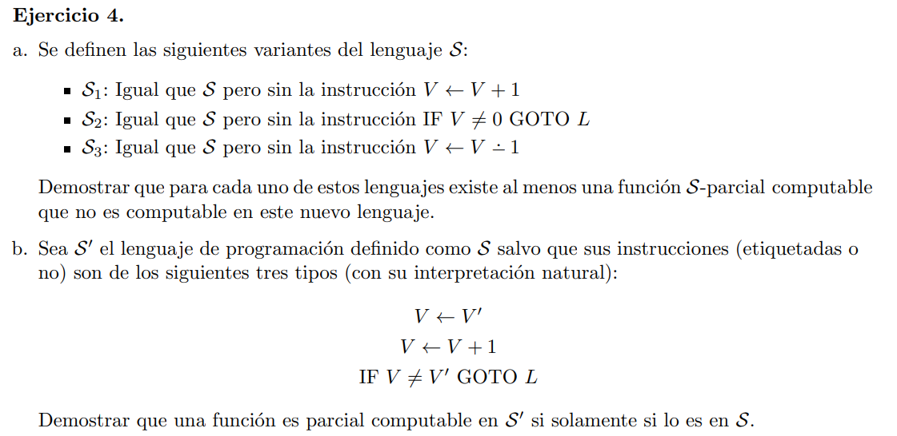

# a

Para $S_1$ la función $f_1(x) = x + 1$ no es computable

Supongamos que lo fuera. Existe un programa P que la computa tq $ψ^{1}_P = f$. 

Dado $x ∈ \N$ tal que $ψ^{1}_P(x)\downarrow$ (en este caso es para todo natural ya que $f$ es total), sea $d_1, d_2 ⋯ d_k$ el cómputo del programa $P$ a partir de dicha entrada $x$ con $d_1$ la desc inicial, $d_k$ la terminal y $d_i[y]$ el valor de $Y$ para la descripción $i, 1 \leq i \leq k$.

Sabemos $d_1[Y] = 0$ y que solo tenemos las instrucciones $V \longleftarrow V - 1$ y $IF \ V \neq 0 \ GOTO \ L$. Luego

$0 = d_1[Y] \geq d_2[Y] \geq \cdots d_k[Y] \implies d_k[Y] = 0$

Entonces realmente el cómputo de P es $ψ^{1}_P(x) = n(x) = 0$ (función nula)

Absurdo, que vino de suponer que f es computable en el lenguaje $S_1$

___

Para $S_2$ la función total $f_2 = \uparrow$ no es computable. Como un programa es una sucesión finita de instruciones, y solo tenemos la instrucción suma y resta todo programa en $S_2$ es finito. Por lo que no hay forma de codificar la indefinición.

___

Para $S_3$ la función $f_3(x) = x-1$ no es computable. El argumento es similar al de $S_1$

# b

$\implies)$ Si tengo una función computable en $S'$ puedo tomar el programa que lo computa y traducir cada instrucción a una equivalente en $S$.


$V \leftarrow V + 1$ ya es una instrucción de $S$ y el condicional es un caso particular del ejercicio 3b donde el predicado es $V' \neq V$ que es S-parcial computable (en la practica 1 ej 4 vimos que $f(x,y) = x \neq y$ es primitiva recursiva)

$\impliedby)$ 

Usando el mismo argumento, armamos la traducción de instrucciones de $S$ a $S'$.

La suma ya está.

Para el condicional podemos usar alguna variable auxiliar no utilizada por el programa escrito en $S$ y usarlo en la comparación (ya que por defecto empiezan en 0):

```c
// en S
IF V ≠ 0 GOTO L

// se traduce a S' como
IF V ≠ Zᵢ GOTO L
// con Zᵢ una variable auxiliar no usada en el programa escrito en S
```

Finalmente la resta se traduce como

```c
    // Z₁, Z₂  variables no usadas, por lo que empiezan en 0
    Z₂ ⟵ Z₂ + 1

    IF V ≠ Z₁ GOTO S // Si V = 0, termino. Sino lopeo
    GOTO E
[S] IF Z₂ ≠ V GOTO L // Si V = 1, termino ya que Z₁= 0 = V - 1. Sino lopeo
    GOTO E

[L] Z₁ ⟵ Z₁ + 1 // siempre Z₁ = Z₂ - 1
    Z₂ ⟵ Z₂ + 1
    IF Z₂ ≠ V GOTO L

[E] V ⟵ Z₁
```