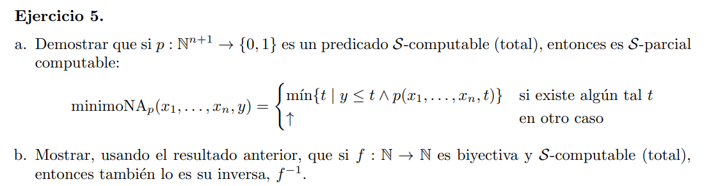

# a

Vamos a escribir un programa que la compute

```c    
    Y ⟵ Xₙ₊₁
    
[L] IF p(x₁⋯ xₙ,  Y) GOTO E
    Y ⟵ Y + 1
    GOTO L

```

# b

Si $f$ es biyectiva $f^{-1}$ tambien por definición. Falta ver la propiedad de S-computable.

Sabemos que la función minimoNA definido en a es parcial computable ya que se puede indefinir existe alguna entrada que no cumpla el predicado $p$. En el caso de $f$ al ser biyectiva y total, la inversa existe para todo natural. Luego defino

$f^{-1}(x) = minimoNA_{f(t) = x}(x, 0)$

Y entonces $f^{-1}$ es S-computable (es total computable proque toda entrada tiene minimo.)