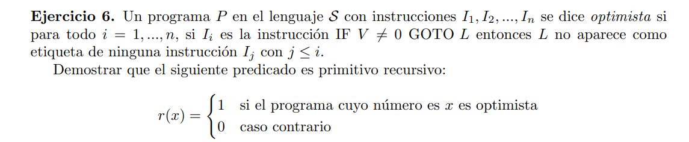

Defino el predicado r'(x, y)

$$ r'(x,y,t)=   \left\{
\begin{array}{ll}
    1 & \text{si la instrucción $y$ tal que $(x + 1)[t] = y$ es un } \\
      & \text{condicional y salta a una instruccion anterior a él} \\
    0 & c.c. \\
\end{array} 
\right.  $$

Luego $r$ lo defino como

$r(x) = \alpha( \ \exist t_{≤ | x + 1 |} \{ t > 0  \wedge r'(x, (x+1)[t], t) \} \ )$

Basta con definir r'(x, y) tal que sea primitivo recursivo,  y asi r será primitivo recursivo

$r'(x,y, t) = r(l(y)) > 2 \wedge (\exist s_{≤ t} ) \{s > 0 ∧ l((x+1)[s]) = r(l(y))-2  \}.$