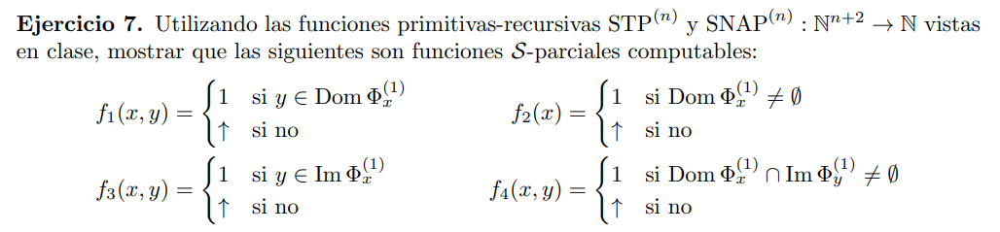

Tenemos dos métodos para probar que una función es parcial computable:

1- Armamos un programa en S que lo compute

2- Probamos que es p.r. (en dicho caso entonces es total computable)

Para el caso 1 podemos usar funciones que ya sabemos que son computables o parcial computables (en este ultimo probariamos que son parcial computables, pero si mostramos que el dominio para el cual se indefinen las funciones parciales no pertenecen al dominio de la función que queremos demostrar, entonces podemos afirmar que es total computable. Ejemplo ej 5)

> $f_1(x, y)$

```c
// X₁ = x, X₂ = y 

[L] IF Z₁ ≠ 0 GOTO E
    Z₁ ⟵ STP⁽¹⁾(X₂, X₁, Z₂)
    Z₂ ⟵ Z₂ + 1
    GOTO L
[E] Y ⟵ 1
```

> $f_2(x)$
```c
// X₁ = x

[L] IF Z₁ ≠ 0 GOTO E
    Z₁ ⟵ STP⁽¹⁾(l(Z₂), X₁, r(Z₂))
    Z₂ ⟵ Z₂ + 1
    GOTO L
[E] Y ⟵ 1
```
Idea: $Z₂$ empieza en 0, por lo que vamos a recorrer todos los naturales. Ahora la codifación de pares es biyectiva, por lo que tambien vamos a recorrer todos los pares de naturales.

Otra forma

```c
    Y ⟵ minₜ { STP⁽¹⁾(l(t), X₁, r(t)) = 1 }
```

> $f_3(x, y)$

```c
// X₁ = x, X₂ = y 
    // si el programa X₁ termina en r(Z₂) pasos para entrada l(Z₂)q
    // y si lo hace con valor de salida = y = X₂
[L] Z₁ ⟵ STP⁽¹⁾(l(Z₂), X₁, r(Z₂)) ∧ (r(SNAP⁽¹⁾(l(Z₂), X₁, r(Z₂))))[1] = X₂
    IF Z₁ = 1 GOTO E
    Z₂ ⟵ Z₂ + 1
    GOTO L
[E] Y ⟵ 1

```

> $f_4(x, y)$

```c
// X₁ = x, X₂ = y 
    // l(l(t)) ∈ Dom Φₓ
    Y ⟵ (∃ t) { STP⁽¹⁾(l(l(t)), X₁, r(l(t))) ∧ STP⁽¹⁾(l(r(t)), X₂, r(r(t)))  ∧ l(l(t)) = (r(SNAP⁽¹⁾(l(r(t), X₂, r(r(t))))))[1] }
```

Idea: Me fijo si existe un natural $t$ tal que $l(l(t))$ pertenece al dominio de $x$ (viendo si termina en al menos $r(l(t))$ pasos ). Luego veo si el programa  $y$ termina con entrada $l(r(t))$ en al menos $r(r(t))$ pasos y si el resultado es justamente $l(l(t))$. Si esto se cumple $l(l(t))$ pertenece al dominio de $x$ y a la imagen de $y$


Obs: hubiera sido mejor si hacia (∃ $<t1, t2, t3, t4>$) y quedaba mas prolijo (perdon xd)