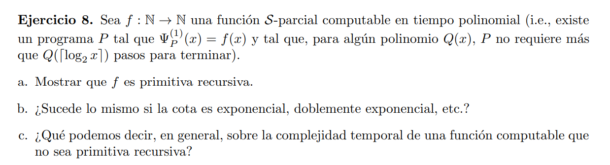

# a

$f(x) = (∃t) ( 0 ≤ t ≤ Q(⌈ log₂ x ⌉)  ∧ STP^{(1)}(x, \#P, t)) \ · \ (r(SNAP^{n}(x,  \#P, t)))[1]$

El predicado del minimo es p.r. por lo que el minimo es p.r.

Así f(x) es primitivo recursivo

# b

